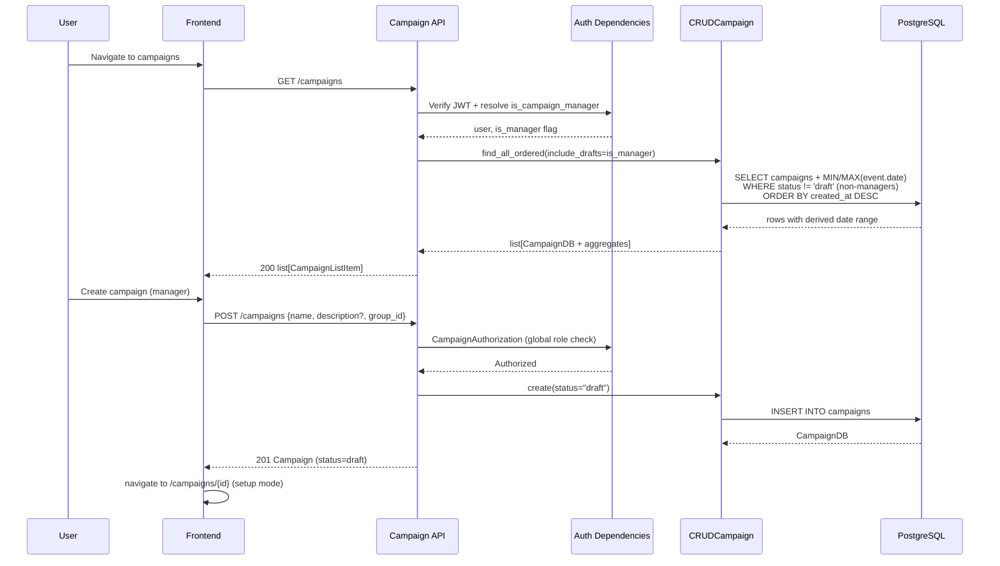
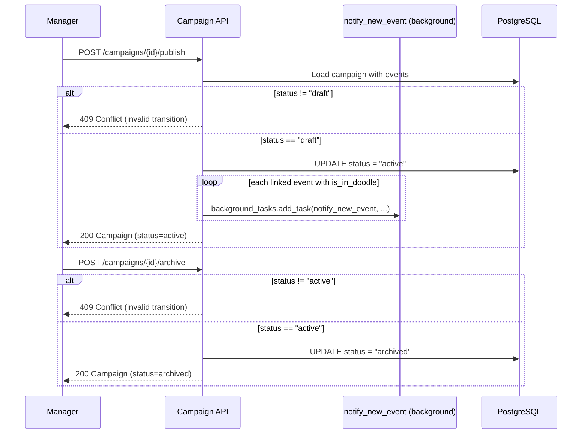
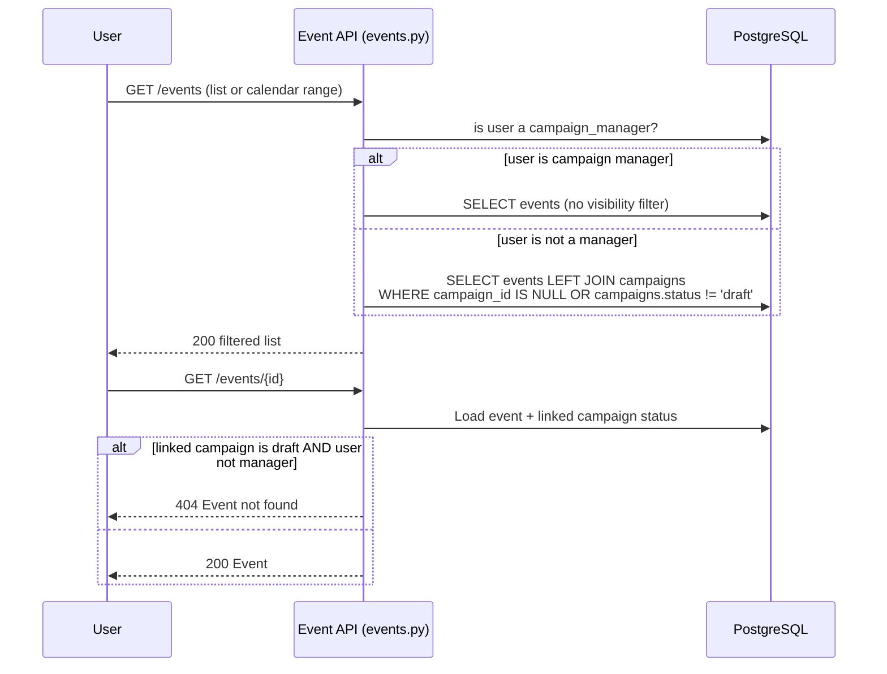
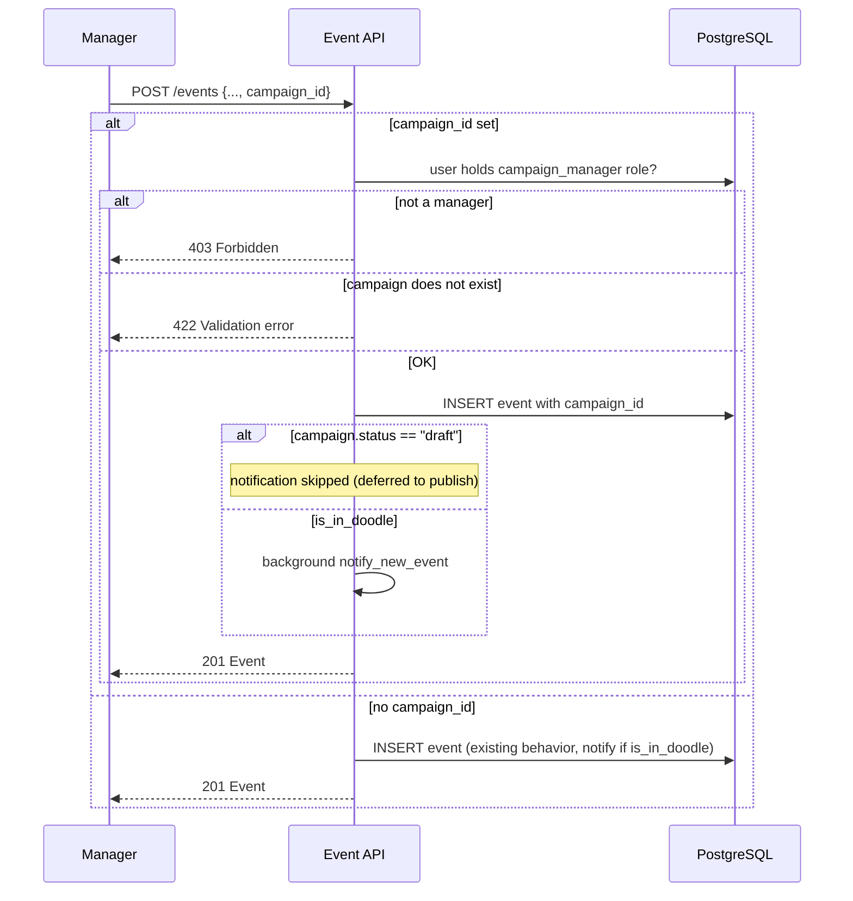
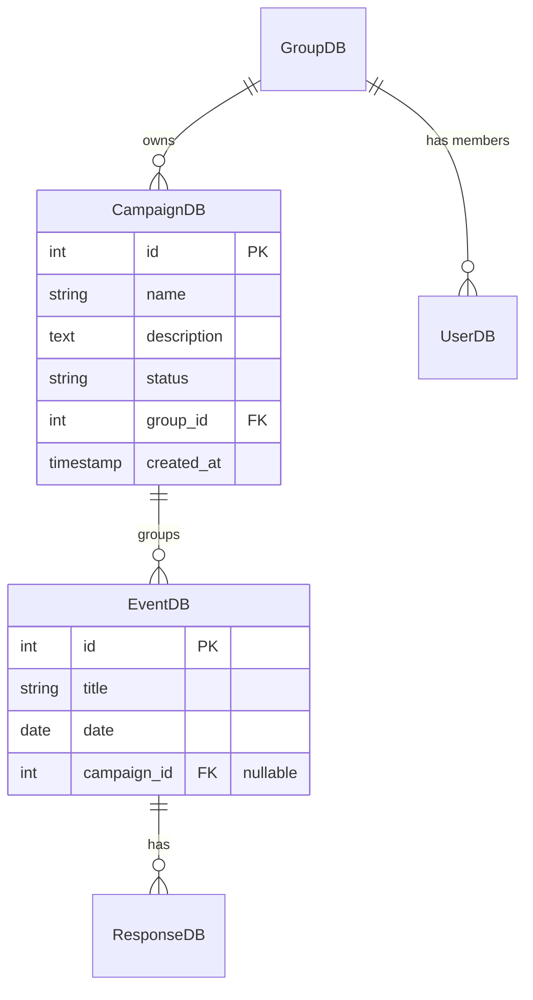
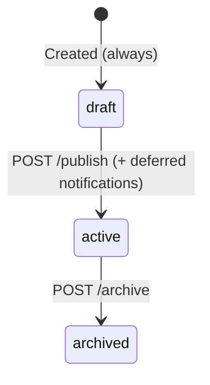

# Design Document: Event Campaigns (v2)

## Overview

The Event Campaigns feature groups related events under a named campaign with a one-way lifecycle status. Campaigns are owned by a group, which controls who can submit attendance responses to its events. Campaign management (create/update/delete/publish/archive/link) is governed by a global role check — any user holding `campaign_manager` in any of their groups can manage any campaign.

This is a **v2 redesign of an implemented v1 feature**. The v1 implementation exists in `backend/bbe2/models/campaign.py`, `backend/bbe2/schemas/campaign.py`, `backend/bbe2/crud/crud_campaign.py`, `backend/bbe2/api/v1/endpoints/campaigns.py`, the campaign eligibility gate in `backend/bbe2/api/v1/endpoints/events.py`, and `frontend/app/src/pages/campaigns/*`. This document describes the target v2 state and explicitly calls out changes from v1.

### Changes from v1

| Area | v1 (current) | v2 (target) |
|------|--------------|-------------|
| Campaign dates | `start_date` (required) / `end_date` (optional) columns, validated `end >= start` | Columns **dropped by migration**; date range derived from linked events (min/max) |
| List ordering | `start_date` descending | `created_at` descending |
| Creation | name, dates, group, optional status | name + group required, description optional; status always `"draft"` (server-enforced, not in schema) |
| Status changes | Free-form via `CampaignUpdate.status` | One-way `draft → active → archived` via dedicated `POST /publish` and `POST /archive` endpoints; status removed from `CampaignUpdate`; invalid transitions → 409 |
| Draft visibility | Drafts visible to everyone | Drafts and their linked events hidden from non-managers (campaign list/detail, event list, calendar, event detail) |
| Notifications | `notify_new_event` fired at event creation when `is_in_doodle` | Skipped at creation when event is linked to a draft campaign; fired for all `is_in_doodle` linked events on publish |
| Event creation | No campaign association | `EventCreate` gains optional `campaign_id` (422 if campaign missing, 403 if requester not a manager) |
| Linkable events | EventLinker loads full event list | Server-side filter: `GET /events/?linkable=true` returns only events with `campaign_id IS NULL` |
| Frontend | Basic list/detail/form/linker | "Nouvelle campagne" button, loading states, setup mode on empty campaigns, per-row unlink, publish/archive actions, multi-link sessions, campaign selector in event form, pre-attached campaign via `/events/add?campaign={id}` |

### Key Design Decisions

1. **Derived date range instead of stored dates**: v1 required managers to guess a date range at creation, which drifted from the actual linked events. v2 drops `start_date`/`end_date` and computes the displayed range as the min/max of linked event dates. The list endpoint computes it server-side with a SQL aggregate (one query, no N+1); the detail endpoint already returns the linked events, so the same derived fields are included for consistency.

2. **Two dedicated transition endpoints (`POST /campaigns/{id}/publish` and `POST /campaigns/{id}/archive`) rather than a single generic transition endpoint**: Each action has distinct side effects — publish triggers deferred notifications, archive does not. Separate endpoints make the OpenAPI-generated client self-documenting (`publishCampaign()` / `archiveCampaign()`), avoid a target-status enum payload that would need its own validation, and keep the side-effect logic (notification fan-out) isolated in the publish handler. The precondition check (current status) is what produces the 409 for invalid transitions.

3. **Status server-enforced, absent from create/update schemas**: `CampaignCreate` and `CampaignUpdate` contain no `status` field. Pydantic ignores unknown fields by default, so a client sending `status` at creation simply has it discarded and the model default `"draft"` applies (requirement 1.5). Status can only move through the transition endpoints (requirement 4.2).

4. **Visibility filtering in the event query layer**: Draft-campaign events are hidden with a single rule — *hidden iff linked campaign status == "draft" AND viewer is not a campaign manager*. This is enforced in the backend event list and detail endpoints (`events.py`) via an outer join filter, so the frontend calendar and event list get correct data for free. A non-raising helper `user_is_campaign_manager(session, user_id) -> bool` (extracted from the existing `CampaignAuthorization` logic in `bbe2/utils/auth.py`) decides which branch applies.

5. **Server-side linkable-event filtering (`linkable=true` query param) rather than client-side filtering**: The EventLinker needs events with `campaign_id IS NULL`. Filtering server-side follows the existing `list_events` query-param style (`is_in_doodle`, `date__gte`), keeps payloads small, and stays correct when another manager links events concurrently — a client-side filter over a cached list would offer stale, already-linked events and produce avoidable 409s (requirement 12.1).

6. **Deferred notifications resolved at two points only**: At event creation, the notification is skipped iff the event is linked to a campaign whose status is `"draft"` (no campaign or non-draft campaign → existing behavior preserved). At publish, the handler iterates the campaign's linked events and fires `notify_new_event` as a background task for each event with `is_in_doodle`. No notification state is persisted — the campaign status itself encodes whether notifications are pending, which keeps the model simple and idempotent-by-construction (publish can only ever fire once because the transition is one-way).

7. **Global role check unchanged from v1**: `CampaignAuthorization` (already in `bbe2/utils/auth.py`) checks whether the user holds `campaign_manager` in *any* group membership. It is reused for the new transition endpoints, and its inner logic is exposed as the non-raising helper for visibility filtering.

## Architecture



### Status Transition and Deferred Notification Flow



### Draft Visibility Flow (Event Endpoints)



### Event Creation with Campaign Flow



## Components and Interfaces

### 1. Campaign Model (`bbe2/models/campaign.py`) — modified

`start_date` and `end_date` are removed:

```python
class CampaignDB(Base):
    __tablename__ = "campaigns"

    id: Mapped[int] = mapped_column(primary_key=True)
    name: Mapped[str] = mapped_column(String(150))
    description: Mapped[Optional[str]] = mapped_column(Text, nullable=True)
    status: Mapped[str] = mapped_column(String(16), default="draft")
    group_id: Mapped[int] = mapped_column(ForeignKey("groups.id"))
    created_at: Mapped[datetime] = mapped_column(default=func.now())

    group: Mapped["GroupDB"] = relationship()
    events: Mapped[list["EventDB"]] = relationship(back_populates="campaign")
```

`EventDB.campaign_id` (nullable FK, `ON DELETE SET NULL`) and the `campaign` relationship are unchanged from v1.

### 2. Pydantic Schemas (`bbe2/schemas/campaign.py`) — modified

Dates and status are removed from the input schemas; derived date-range fields are added to the output schemas:

```python
class CampaignCreate(BaseModel):
    """No status field: status is server-enforced to 'draft'.
    Unknown fields (e.g. a client-sent 'status') are ignored by Pydantic."""
    name: str = Field(max_length=150)
    description: Optional[str] = None
    group_id: int


class CampaignUpdate(BaseModel):
    """No status field: transitions go through /publish and /archive only."""
    name: Optional[str] = Field(default=None, max_length=150)
    description: Optional[str] = None
    group_id: Optional[int] = None


class CampaignEvent(BaseModel):
    model_config = ConfigDict(from_attributes=True)
    id: int
    title: str
    date: date
    category: str


class CampaignListItem(BaseModel):
    model_config = ConfigDict(from_attributes=True)
    id: int
    name: str
    description: Optional[str] = None
    status: str
    group_id: int
    group: MinimalGroup
    created_at: datetime
    # Derived date range: min/max of linked event dates, None when no events
    first_event_date: Optional[date] = None
    last_event_date: Optional[date] = None


class Campaign(BaseModel):
    model_config = ConfigDict(from_attributes=True)
    id: int
    name: str
    description: Optional[str] = None
    status: str
    group_id: int
    group: MinimalGroup
    created_at: datetime
    events: list[CampaignEvent] = []
    first_event_date: Optional[date] = None
    last_event_date: Optional[date] = None
```

### 3. Event Schemas (`bbe2/schemas/event.py`) — modified

```python
class EventCreate(_EventBase):
    campaign_id: Optional[int] = None  # v2: optional campaign association


class Event(_EventBase):
    model_config = ConfigDict(from_attributes=True)
    id: int
    campaign_id: Optional[int] = None  # v2: exposed so frontend knows linkage
```

Campaign existence (422) and manager permission (403) checks happen in the endpoint, not the schema, because they need the DB session and the current user.

### 4. CRUD Layer (`bbe2/crud/crud_campaign.py`) — modified

```python
class CRUDCampaign(CRUDBase[CampaignDB, CampaignCreate, CampaignUpdate]):
    model = CampaignDB

    def find_all_ordered(self, include_drafts: bool) -> list[Row]:
        """Campaigns ordered by created_at DESC with derived date range.

        Non-managers get include_drafts=False, which excludes drafts.
        The min/max event dates are computed in SQL via LEFT JOIN + GROUP BY
        to avoid N+1 queries.
        """
        q = (
            self.db_session.query(
                self.model,
                func.min(EventDB.date).label("first_event_date"),
                func.max(EventDB.date).label("last_event_date"),
            )
            .outerjoin(EventDB, EventDB.campaign_id == self.model.id)
            .options(selectinload(self.model.group))
            .group_by(self.model.id)
            .order_by(self.model.created_at.desc())
        )
        if not include_drafts:
            q = q.filter(self.model.status != "draft")
        return q.all()

    def get_with_events(self, campaign_id: int) -> CampaignDB | None:
        # unchanged from v1 (eager-loads events and group)
        ...
```

### 5. Authorization Helpers (`bbe2/utils/auth.py`) — extended

`CampaignAuthorization` (v1, unchanged) guards all management endpoints, including the new transition endpoints. Its core check is extracted into a reusable, non-raising helper used by the event visibility filter and the event-creation permission check:

```python
def user_is_campaign_manager(session: Session, user_id: str) -> bool:
    """True if the user holds 'campaign_manager' in any group membership."""
    user = session.get(UserDB, user_id)
    if not user:
        return False
    return any(
        any(role.id == CampaignAuthorization.ROLE_ID for role in group.roles)
        for group in user.groups
    )
```

### 6. Campaign Endpoints (`bbe2/api/v1/endpoints/campaigns.py`) — modified

```python
# --- Read endpoints (any authenticated user; drafts filtered) ---

@campaigns_router.get("/", response_model=list[schemas.CampaignListItem])
async def list_campaigns(...):
    # include_drafts = user_is_campaign_manager(session, current_user)
    # ordered by created_at DESC (Req 2.1–2.3)

@campaigns_router.get("/{campaign_id}", response_model=schemas.Campaign)
async def get_campaign(...):
    # 404 if not found OR (status == "draft" AND not manager) (Req 2.4–2.6)

# --- Write endpoints (CampaignAuthorization) ---

@campaigns_router.post("/", response_model=schemas.Campaign, status_code=201)
async def create_campaign(...):
    # group existence check -> 422; status forced to "draft" (Req 1.x)

@campaigns_router.patch("/{campaign_id}", response_model=schemas.Campaign)
async def update_campaign(...):
    # name/description/group_id only; no status, no date validation (Req 4.x)

@campaigns_router.delete("/{campaign_id}", status_code=204)
async def delete_campaign(...):
    # unchanged from v1; FK ON DELETE SET NULL unlinks events (Req 5.x)

# --- Status transitions (CampaignAuthorization) — NEW in v2 ---

@campaigns_router.post("/{campaign_id}/publish", response_model=schemas.Campaign)
async def publish_campaign(
    campaign_id: int, ..., background_tasks: BackgroundTasks
):
    # 404 if missing; 409 unless status == "draft"
    # set status = "active"
    # for each linked event with is_in_doodle:
    #     background_tasks.add_task(notify_new_event, sender, settings, event, event.id)
    # (Req 3.1, 3.3, 9.4, 9.5)

@campaigns_router.post("/{campaign_id}/archive", response_model=schemas.Campaign)
async def archive_campaign(campaign_id: int, ...):
    # 404 if missing; 409 unless status == "active"; set status = "archived"
    # (Req 3.2, 3.3)

# --- Event linking (CampaignAuthorization) — unchanged from v1 ---
# POST   /campaigns/{campaign_id}/events/{event_id}  (409 if already linked elsewhere)
# DELETE /campaigns/{campaign_id}/events/{event_id}
```

Transition validity is a pure precondition table:

| Endpoint | Allowed current status | Result | Otherwise |
|----------|------------------------|--------|-----------|
| `POST /publish` | `draft` | `active` + notification fan-out | 409 |
| `POST /archive` | `active` | `archived` | 409 |

### 7. Event Endpoints (`bbe2/api/v1/endpoints/events.py`) — modified

**`list_events`** gains draft visibility filtering and the `linkable` filter:

```python
@events_router.get("/", response_model=list[schemas.Event], ...)
async def list_events(
    session: SessionDep,
    identifier: Annotated[str, Depends(get_current_user2)],
    ...,
    linkable: Optional[bool] = None,  # NEW: campaign_id IS NULL (Req 12.1)
):
    q = session.query(models.EventDB)
    # Draft visibility (Req 8.1, 8.2): hidden iff draft campaign AND not manager
    if not user_is_campaign_manager(session, identifier):
        q = q.outerjoin(models.CampaignDB).filter(
            or_(
                models.EventDB.campaign_id.is_(None),
                models.CampaignDB.status != "draft",
            )
        )
    if linkable:
        q = q.filter(models.EventDB.campaign_id.is_(None))
    # ... existing date / is_in_doodle / ordering filters unchanged ...
```

The frontend calendar consumes this same endpoint with date-range params, so requirement 8.3 is satisfied by the backend filter without calendar-specific code.

**`get_event`** returns 404 for draft-campaign events requested by non-managers (requirement 8.4):

```python
    if (
        db_event.campaign_id
        and db_event.campaign.status == "draft"
        and not user_is_campaign_manager(session, identifier)
    ):
        raise HTTPException(status_code=404, detail="Event not found")
```

**`create_event`** gains campaign validation and deferred notification (requirements 7.1–7.4, 9.1–9.3):

```python
async def create_event(event: schemas.EventCreate, ...):
    campaign = None
    if event.campaign_id is not None:
        if not user_is_campaign_manager(session, identifier):
            raise HTTPException(status_code=403, ...)
        campaign = session.get(models.CampaignDB, event.campaign_id)
        if not campaign:
            raise HTTPException(status_code=422, detail="Campaign not found")

    db_event = event_crud.create(**event.model_dump())

    # Deferred notification: skip iff linked campaign is a draft (Req 9.3)
    campaign_is_draft = campaign is not None and campaign.status == "draft"
    if event.is_in_doodle and not campaign_is_draft:
        background_tasks.add_task(notify_new_event, sender, settings, event, db_event.id)

    return db_event
```

Note: `notify_new_event` currently takes the `EventCreate` schema. The publish handler works from `EventDB` rows, so it constructs the schema object from the ORM instance (or `notify_new_event` is adapted to accept either) — an implementation detail resolved at task time.

**`create_response`** eligibility gate is unchanged from v1 (requirements 15.1–15.3).

### 8. Frontend Components — modified

| Component | Path | v2 changes |
|-----------|------|------------|
| `CampaignListPage` | `pages/campaigns/list.tsx` | "Nouvelle campagne" button (managers, Req 10.7); loading indicator instead of empty state while fetching (Req 10.8); derived date range display, none when no events (Req 10.1–10.2); ordering by creation date comes from API |
| `CampaignDetailPage` | `pages/campaigns/detail.tsx` | Loading state (Req 11.11); description rendered exactly once (Req 11.3); derived date range (Req 11.1–11.2); setup mode: add-events call to action for managers on empty campaigns (Req 11.6); event rows navigate to event detail (Req 11.5) with per-row unlink action for managers (Req 11.9); publish/archive buttons shown per status (Req 3.6–3.7); "Créer un évènement" navigates to `/events/add?campaign={id}` (Req 7.5) |
| `CampaignForm` | `pages/campaigns/components/CampaignForm.tsx` | Reduced to name / description / group; date fields and status selector removed; cancel button returns to previous page (Req 4.5–4.6); on successful create, navigate to the new campaign's detail page (Req 1.9) |
| `EventLinker` | `pages/campaigns/components/EventLinker.tsx` | Fetches `GET /events/?linkable=true`; stays open after each link (multi-link session, Req 12.2); removes linked event from the displayed list (Req 12.3); text filter on title/date (Req 12.4); explicit close action (Req 12.5) |
| `CampaignStatusBadge` | `pages/campaigns/components/StatusBadge.tsx` | Unchanged (Req 10.5) |
| `EventForm` | `pages/events/*` | Optional campaign selector shown to managers (Req 7.6); pre-selects campaign from `?campaign={id}` query param |

After backend changes, the API client is regenerated with `yarn generate-client && yarn build:lib` so `publishCampaign`, `archiveCampaign`, the `linkable` param, and the schema changes flow through to TypeScript.

## Data Models

### CampaignDB Table Schema (v2)

| Column | Type | Nullable | Default | Constraints |
|--------|------|----------|---------|-------------|
| `id` | Integer | No | Auto-increment | Primary key |
| `name` | String(150) | No | — | Required |
| `description` | Text | Yes | NULL | — |
| `status` | String(16) | No | "draft" | One of: draft, active, archived; transitions one-way |
| `group_id` | Integer | No | — | FK → groups.id |
| `created_at` | Timestamp | No | now() | Auto-generated |

`start_date` and `end_date` no longer exist (dropped by migration).

### EventDB Extension (unchanged from v1)

| Column | Type | Nullable | Default | Constraints |
|--------|------|----------|---------|-------------|
| `campaign_id` | Integer | Yes | NULL | FK → campaigns.id, ON DELETE SET NULL |

### Relationships



### Alembic Migration (v2)

The campaigns table already exists; the v2 migration only drops the date columns:

```python
def upgrade():
    op.drop_column("campaigns", "start_date")
    op.drop_column("campaigns", "end_date")

def downgrade():
    # start_date was NOT NULL in v1; restore with a server_default so the
    # downgrade succeeds on populated tables, then drop the default.
    op.add_column(
        "campaigns",
        sa.Column("start_date", sa.Date(), nullable=False, server_default=sa.func.current_date()),
    )
    op.add_column("campaigns", sa.Column("end_date", sa.Date(), nullable=True))
    op.alter_column("campaigns", "start_date", server_default=None)
```

Dropping the columns is destructive to v1 data by design: the stored date ranges were manager guesses that the derived range replaces. No data backfill is needed.

### Campaign Status Lifecycle (v2 — enforced)



Unlike v1, transitions **are enforced by the API**: any transition other than draft → active (publish) or active → archived (archive) returns 409. There is no path back from active or archived.

## Correctness Properties

*A property is a characteristic or behavior that should hold true across all valid executions of a system — essentially, a formal statement about what the system should do. Properties serve as the bridge between human-readable specifications and machine-verifiable correctness guarantees.*

Changes from v1: the date-range validation property is **removed** (dates no longer exist on campaigns); the round-trip, authorization, ordering, deletion, uniqueness, link/unlink, and eligibility properties are **kept and adapted**; new properties are **added** for one-way status transitions, draft visibility, deferred notifications, and derived date range.

### Property 1: Campaign Creation Round-Trip

*For any* valid campaign creation payload (name ≤ 150 chars, optional description, existing group_id), creating the campaign and then retrieving it by ID SHALL return an object with the submitted name, description, and group matching the input, plus a generated integer identifier and a created_at timestamp.

**Validates: Requirements 1.1, 1.3, 1.6, 2.4**

### Property 2: Created Status Is Always Draft

*For any* campaign creation payload, including payloads carrying an arbitrary injected `status` value ("active", "archived", or any string), the created campaign SHALL have status `"draft"`.

**Validates: Requirements 1.4, 1.5**

### Property 3: Global Campaign Management Authorization

*For any* authenticated user and any campaign management operation (create, update, delete, publish, archive, link, unlink, and event creation with a `campaign_id`), the operation SHALL succeed if and only if the user holds the `campaign_manager` role in at least one of their group memberships, regardless of which group owns the campaign. Otherwise, the API SHALL return 403.

**Validates: Requirements 1.8, 3.5, 4.4, 5.4, 6.8, 7.4, 14.3, 14.4, 14.5**

### Property 4: Campaign List Ordering

*For any* set of campaigns in the database, the list endpoint SHALL return the campaigns visible to the requester in descending order of `created_at`.

**Validates: Requirements 2.1, 10.3**

### Property 5: Draft Campaign Visibility

*For any* set of campaigns with mixed statuses and any authenticated viewer, a campaign SHALL appear in the campaign list and be retrievable by ID if and only if its status is not `"draft"` or the viewer is a campaign manager. A non-manager requesting a draft campaign by ID SHALL receive 404.

**Validates: Requirements 2.2, 2.3, 2.5, 14.1, 14.2**

### Property 6: One-Way Status Transitions

*For any* campaign in any status and any transition action (publish or archive), the transition SHALL succeed if and only if it matches the allowed table — publish on a `"draft"` campaign (→ `"active"`) or archive on an `"active"` campaign (→ `"archived"`). All other (status, action) pairs SHALL return 409 and leave the campaign status unchanged.

**Validates: Requirements 3.1, 3.2, 3.3**

### Property 7: Campaign Update Round-Trip Preserves Status

*For any* valid partial update payload (name, description, group_id) applied to an existing campaign, the returned campaign SHALL reflect the provided fields, preserve unprovided fields, and — even when an arbitrary `status` value is injected into the payload — SHALL have the same status as before the update.

**Validates: Requirements 4.1, 4.2**

### Property 8: Deletion Preserves Events

*For any* campaign with zero or more linked events, deleting the campaign SHALL result in those events still existing in the database with their `campaign_id` set to NULL. The events themselves SHALL NOT be deleted.

**Validates: Requirements 5.1, 5.3, 13.5**

### Property 9: Event Uniqueness Constraint

*For any* sequence of link operations across multiple campaigns, each event SHALL be linked to at most one campaign at any time, and attempting to link an event already linked to a different campaign SHALL return 409 without changing the existing association.

**Validates: Requirements 6.2, 6.3**

### Property 10: Link/Unlink Round-Trip

*For any* valid event and campaign, after linking the event to the campaign, retrieving the campaign SHALL include that event in its events list. After unlinking, retrieving the campaign SHALL NOT include that event, and the event SHALL still exist with `campaign_id = NULL`.

**Validates: Requirements 6.1, 6.6**

### Property 11: Draft Event Visibility

*For any* event (unlinked, or linked to a campaign of any status) and any authenticated viewer, the Event API SHALL hide the event (excluded from the event list; 404 on detail) if and only if the event is linked to a campaign with status `"draft"` and the viewer is not a campaign manager. In particular: events of active or archived campaigns and unlinked events (including events just unlinked from a draft campaign) SHALL be visible to all users, and publishing a draft campaign SHALL make all its linked events visible to all users.

**Validates: Requirements 6.7, 8.1, 8.2, 8.4, 8.5, 8.6, 8.7, 14.1, 14.2**

### Property 12: Creation-Time Notification Rule

*For any* event creation payload with any `is_in_doodle` value and any campaign linkage (none, draft campaign, or active campaign), the Notification Service SHALL be invoked at creation time if and only if `is_in_doodle` is true and the event is not linked to a draft campaign.

**Validates: Requirements 9.1, 9.2, 9.3**

### Property 13: Publish Notification Exactness

*For any* draft campaign with an arbitrary mix of linked events (with and without `is_in_doodle`), publishing the campaign SHALL invoke the Notification Service exactly once for each linked event with `is_in_doodle`, and for no other event. When no linked event has `is_in_doodle`, no notification SHALL be sent.

**Validates: Requirements 9.4, 9.5**

### Property 14: Derived Date Range and Event Ordering

*For any* campaign with an arbitrary set of linked events, the API SHALL report `first_event_date` equal to the minimum linked event date and `last_event_date` equal to the maximum, or both as null when the campaign has no linked events; and the campaign detail SHALL list the linked events ordered by date ascending.

**Validates: Requirements 13.7, 10.1, 10.2, 11.4**

### Property 15: Linkable Event Filter

*For any* set of events with arbitrary campaign linkage, the event list queried with `linkable=true` SHALL return exactly the events whose `campaign_id` is NULL.

**Validates: Requirements 12.1**

### Property 16: Response Eligibility Based on Group Membership

*For any* event linked to a campaign, an authenticated user SHALL be able to submit an attendance response if and only if the user is a member of the campaign's owning group. Non-members SHALL receive a 403 response.

**Validates: Requirements 15.1, 15.2, 14.7**

### Property 17: Unlinked Events Preserve Open Response Access

*For any* event with `campaign_id = NULL`, any authenticated user SHALL be able to submit an attendance response regardless of their group memberships. The campaign eligibility check SHALL NOT apply.

**Validates: Requirements 15.3**

## Error Handling

### API Error Responses

| Scenario | HTTP Status | Error Detail |
|----------|-------------|--------------|
| Missing JWT or invalid token | 401 | "Unauthorized" |
| User lacks `campaign_manager` role attempting a management operation (incl. publish/archive, event creation with campaign_id) | 403 | "Insufficient permissions" |
| Non-group-member submitting response to campaign event | 403 | "Not eligible to respond" |
| Campaign not found (incl. draft campaign requested by non-manager) | 404 | "Campaign not found" |
| Event not found (incl. draft-campaign event detail requested by non-manager) | 404 | "Event not found" |
| Missing required field (name, group_id) at creation | 422 | Pydantic validation detail |
| Owning group does not exist | 422 | "Group not found" |
| `campaign_id` in event creation references a nonexistent campaign | 422 | "Campaign not found" |
| Name exceeds 150 characters | 422 | Pydantic max_length validation detail |
| Publish on a non-draft campaign | 409 | "Cannot publish a campaign with status '{status}'" |
| Archive on a non-active campaign | 409 | "Cannot archive a campaign with status '{status}'" |
| Event already linked to another campaign | 409 | "Event is already linked to a campaign" |

Removed from v1: the `end_date < start_date` 422 (dates no longer exist) and the invalid-status-value 422 (status no longer accepted as input).

Note that hiding draft resources uses **404, not 403**, for non-managers — a 403 would leak the existence of the draft.

### Edge Cases

- **Publish/archive race**: two concurrent publishes on the same draft — the second sees status `"active"` and returns 409. Since the status check and update happen in one transaction, notifications cannot be double-fired.
- **Event created in a draft campaign, then unlinked, campaign later published**: the unlinked event received no notification at creation and is not linked at publish time, so it gets none from the publish fan-out either. This is accepted: the manager unlinked it from the announcement batch deliberately. If it should notify, the manager can toggle it via the normal event flow.
- **Draft campaign deleted without publishing**: linked events become unlinked (visible, per Property 11) but their deferred notifications are never sent. Accepted: deleting a draft discards its announcement.
- **`linkable=true` combined with visibility filter**: linkable events have `campaign_id IS NULL`, so they are never draft-hidden; the two filters compose without conflict.
- **Update with partial fields**: `CampaignUpdate` uses `Optional` fields and `exclude_unset=True` in the CRUD layer.
- **Migration on populated table**: dropping `start_date`/`end_date` loses v1 data by design (see Data Models); the downgrade uses a `server_default` to satisfy the NOT NULL constraint.

## Testing Strategy

### Unit Tests (pytest)

- **Schema validation**: `CampaignCreate`/`CampaignUpdate` reject missing name/group, over-long names; confirm no `status`/date fields are accepted as meaningful input; `EventCreate` accepts optional `campaign_id`.
- **CRUD layer**: `find_all_ordered` draft filtering and aggregate correctness against a test database.
- **Transition endpoints**: representative 404 (missing campaign) and happy-path cases.
- **Migration**: schema no longer contains `start_date`/`end_date` after upgrade (smoke, Req 13.1–13.3, 13.6).
- **Error scenarios**: nonexistent campaign/event/group IDs (404/422), unauthenticated 401 on each endpoint.

Kept intentionally light — the property tests below carry the input-space coverage.

### Property-Based Tests (Hypothesis)

Property-based testing remains appropriate: the feature is backend logic with universal invariants (visibility iff-rules, transition tables, notification exactness, derived aggregates) and round-trips, all cheap to run against a test database with a mocked notifier.

- **Library**: [Hypothesis](https://hypothesis.readthedocs.io/) (already in use in this repo)
- **Minimum iterations**: 100 per property
- **Tag format**: `# Feature: event-campaigns, Property N: <description>`
- Each correctness property is implemented by a **single** Hypothesis test.

Changes from the v1 test suite:
- **Remove** the date-range validation property test (Property 2 in v1) — dates no longer exist.
- **Adapt** ordering (now `created_at` desc), update round-trip (now asserts status immutability), authorization (now includes publish/archive and event creation with `campaign_id`).
- **Add** tests for Properties 2, 5, 6, 11, 12, 13, 14, 15.

| Property | Test approach |
|----------|---------------|
| 1 Creation round-trip | Random valid payloads → create → retrieve → compare |
| 2 Status always draft | Inject random status values into creation payloads |
| 3 Authorization | Random user/group/role combos × each management operation |
| 4 List ordering | Random campaign sets with random created_at → verify sort |
| 5 Draft campaign visibility | Mixed statuses × manager/non-manager viewers → list + detail |
| 6 One-way transitions | Random (status, action) pairs → verify transition table + 409 |
| 7 Update round-trip | Random partial payloads with injected status → status unchanged |
| 8 Deletion preserves events | Campaigns with random linked events → delete → events survive |
| 9 Uniqueness | Random link sequences across campaigns → invariant + 409 |
| 10 Link/unlink round-trip | Random pairs → link → member; unlink → absent, event survives |
| 11 Draft event visibility | Events in all linkage states × viewer roles, incl. publish-then-visible sequences → list + detail iff-rule |
| 12 Creation notification | Random is_in_doodle × linkage (none/draft/active), mocked `notify_new_event` → called iff rule |
| 13 Publish notification exactness | Draft campaigns with random doodle/non-doodle mixes, mocked notifier → call set == is_in_doodle linked events |
| 14 Derived range + ordering | Campaigns with random event date sets (incl. empty) → min/max/None + ascending order |
| 15 Linkable filter | Random linkage states → `linkable=true` result == unlinked set |
| 16 Response eligibility | Random membership combos → accepted iff member |
| 17 Open response for unlinked | Random unlinked events × users → always accepted |

### Integration Tests

- Full v2 lifecycle: create (draft) → link/create events (hidden, no notifications) → publish (visible, notifications fired) → archive.
- Draft-campaign event excluded from the calendar for non-managers, visible for managers (Req 8.3).
- Migration applied against a database populated with v1 campaigns.
- Notification fan-out with the real background task machinery (single representative case; exactness is covered by Property 13 with mocks).

### E2E Tests (Playwright)

- Manager: "Nouvelle campagne" → create with name + group → lands on detail page in setup mode with add-events call to action.
- Multi-link session: open EventLinker, link two events in a row without the dialog closing, each disappearing from the linkable list, then explicit close.
- "Créer un évènement" from campaign detail → event form opens with campaign pre-selected (`?campaign={id}`).
- Publish flow: draft campaign invisible to a non-manager (list, detail 404, event list, calendar); after publish, everything visible.
- Publish and archive buttons appear only in the correct status and only for managers.
- Per-row unlink action on linked events (manager); event row navigation to event detail.
- Loading indicators on list and detail pages; description rendered once; empty campaign shows no date range.
- Cancel button in CampaignForm returns to previous page.
- Response eligibility: group member can respond, non-member sees the ineligibility message.
