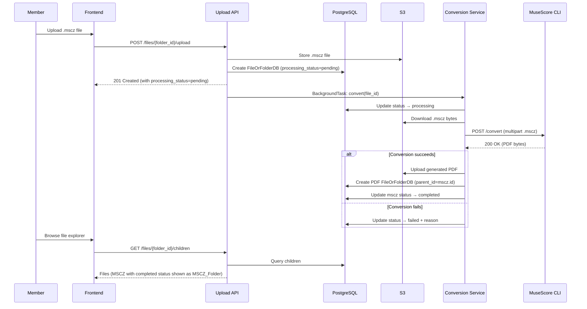
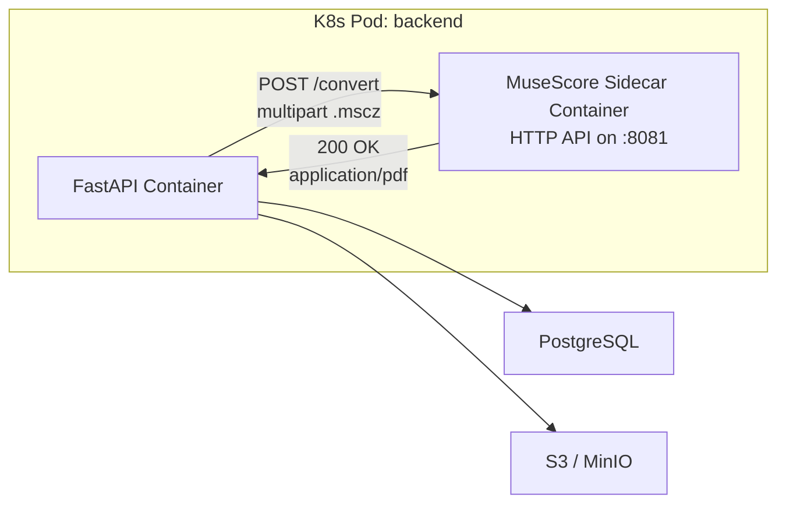
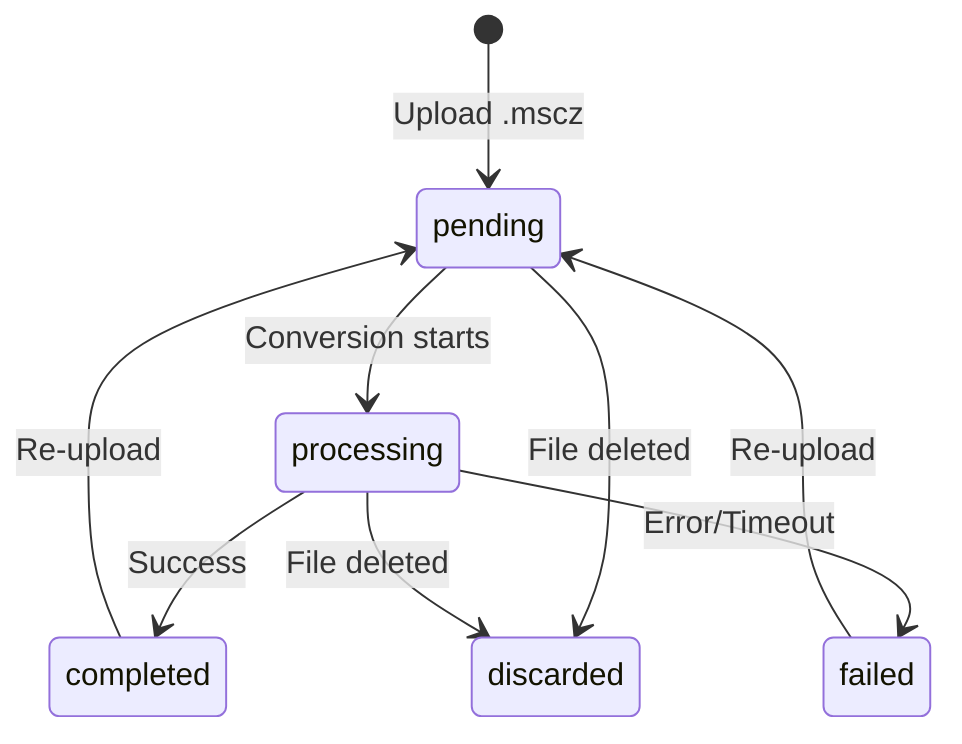

# Design Document: MSCZ-to-PDF Export

## Overview

This feature adds automatic PDF generation for MuseScore (.mscz) files uploaded through the Bagad Men Ru file explorer. When a member uploads a `.mscz` file, the system asynchronously converts it to PDF using the MuseScore CLI, stores the result in S3, and presents both files as a virtual folder in the file explorer.

The design leverages FastAPI's `BackgroundTasks` for the async conversion pipeline, a containerized MuseScore 4 headless instance for rendering, and extends the existing `FileOrFolderDB` model with conversion tracking columns. The frontend presents completed conversions as expandable MSCZ folders while showing conversion status for in-progress or failed conversions.

### Key Design Decisions

1. **BackgroundTasks over a separate worker queue**: The conversion is CPU-bound but infrequent (a few uploads per week for a small ensemble). FastAPI's `BackgroundTasks` avoids the operational complexity of Redis/Celery for this scale. If load increases, the conversion service module is isolated enough to move to a dedicated worker.

2. **MuseScore as an HTTP microservice sidecar**: MuseScore 4 runs in a dedicated Docker container exposing a simple HTTP API. The backend sends the .mscz file via HTTP POST to `http://localhost:<port>/convert` and receives the PDF in the response. Both containers share the pod network (localhost in K8s) so no external networking is needed. This avoids arch/libc coupling — each container runs its own stack independently.

3. **Generated PDF as child via `parent_id`**: The generated PDF record uses the existing `parent_id` FK to point to the MSCZ file record. This reuses the existing relationship and gets cascade delete for free (`ondelete="cascade"`). A generated file is identified by having a FILE-type parent (normal children have DIR-type parents). The frontend presents MSCZ files with completed children as expandable folders.

## Architecture



### Deployment Architecture



The MuseScore sidecar exposes a lightweight HTTP endpoint (`POST /convert`). The backend sends the `.mscz` file as multipart form data and receives the PDF bytes in the response. Both containers share the pod's localhost network — no service discovery or external routing needed.

## Components and Interfaces

### 1. Conversion Service (`bbe2/services/conversion.py`)

A new service module responsible for orchestrating the MSCZ-to-PDF conversion.

```python
class ConversionService:
    """Orchestrates MSCZ to PDF conversion."""

    def __init__(self, s3: S3Helper, session_factory: sessionmaker, musescore_url: str = "http://localhost:8081"):
        self.s3 = s3
        self.session_factory = session_factory
        self.timeout_seconds = 120
        self.musescore_url = musescore_url

    async def convert(self, file_id: int) -> None:
        """Run the full conversion pipeline for a given file."""
        ...

    def _derive_pdf_name(self, mscz_name: str) -> str:
        """Replace trailing .mscz with .pdf."""
        ...

    def _derive_pdf_key(self, mscz_key: str) -> str:
        """Replace trailing .mscz with .pdf in S3 key."""
        ...

    async def _invoke_musescore(self, mscz_bytes: bytes, filename: str) -> bytes:
        """Send .mscz to the MuseScore HTTP sidecar and return PDF bytes."""
        ...
```

**Interface contract:**
- `convert(file_id)`: Downloads the .mscz from S3, sends it to the MuseScore sidecar via HTTP, uploads the resulting PDF to S3, creates the DB record, and updates status. Handles all error cases internally.
- `_derive_pdf_name(name)`: Pure function. Replaces only the final `.mscz` with `.pdf`.
- `_derive_pdf_key(key)`: Pure function. Same logic applied to S3 keys.
- `_invoke_musescore(mscz_bytes, filename)`: Sends a POST request to the sidecar's `/convert` endpoint with the file as multipart form data. Returns PDF bytes on success. Raises `TimeoutError` (httpx timeout at 120s) or `httpx.HTTPStatusError` on failure.

### 2. Modified Upload Endpoint (`bbe2/api/v1/endpoints/files.py`)

The existing `upload_file` endpoint is extended to:
1. Detect `.mscz` files by extension
2. Set `processing_status = "pending"` on the created record
3. Enqueue a background task for conversion

```python
@router.post("/{folder_id}/upload", ...)
async def upload_file(
    folder_id: int,
    file: UploadFile,
    file_crud: Annotated[CRUDFile, Depends()],
    s3: S3Dep,
    background_tasks: BackgroundTasks,
    force: bool = False,
):
    # ... existing upload logic ...

    is_mscz = file.filename.lower().endswith(".mscz")

    db_file = file_crud.create(
        type=FileOrFolderType.FILE,
        name=file.filename,
        file_key=filename,
        parent_id=folder_id,
        processing_status="pending" if is_mscz else None,
    )

    if is_mscz:
        background_tasks.add_task(conversion_service.convert, db_file.id)

    return db_file
```

### 3. Modified Delete Endpoint

The existing `delete_file` endpoint is extended to:
1. Reject deletion of files whose parent is a FILE (i.e., generated files) with 403
2. Cascade delete of the linked PDF is handled automatically by the DB (`ondelete="cascade"` on `parent_id`)
3. Mark in-progress conversions as discarded before deleting

### 4. Modified File Schema (`bbe2/schemas/file.py`)

Extended to expose conversion status and handle MSCZ folder presentation:

```python
class FileOrFolder(_FileOrFolderBase):
    # ... existing fields ...
    processing_status: Optional[str] = None
    processing_failure_reason: Optional[str] = None
    is_generated: bool = False  # True when parent is a FILE (not a DIR)
    is_mscz_folder: bool = False  # computed: True when processing_status=completed and has PDF child
    children: Optional[list["FileOrFolder"]] = None  # populated for MSCZ folders
```

### 5. Children Endpoint Transformation

The `list_children` endpoint applies a transformation layer:
- Files with `processing_status == "completed"` and a child PDF record are returned with `is_mscz_folder=True` and their display name stripped of `.mscz`. The child PDF is included in the `children` array.
- Generated PDFs (files whose `parent_id` points to a FILE-type record) are excluded from the parent folder listing — they only appear as children of their MSCZ file.
- Detection of generated files: a file is "generated" if its parent record has `type = FILE` (normal files have parents with `type = DIR`).

### 6. MuseScore HTTP Microservice Sidecar

A lightweight HTTP service wrapping MuseScore CLI:

```dockerfile
FROM ubuntu:22.04
RUN apt-get update && apt-get install -y \
    musescore4 \
    xvfb \
    python3 python3-pip \
    && pip3 install flask \
    && rm -rf /var/lib/apt/lists/*

COPY convert_server.py /app/convert_server.py
EXPOSE 8081
ENTRYPOINT ["python3", "/app/convert_server.py"]
```

The sidecar exposes a single endpoint:

```
POST /convert
Content-Type: multipart/form-data
Body: file=<.mscz binary>

Response: 200 OK
Content-Type: application/pdf
Body: <PDF binary>

Error: 422 (invalid file) or 500 (MuseScore crash)
```

Internally, the server:
1. Saves the uploaded .mscz to a temp file
2. Runs `xvfb-run musescore4 -o /tmp/output.pdf /tmp/input.mscz`
3. Returns the PDF bytes in the response
4. Cleans up temp files

For local development, the sidecar is added as a service in `docker-compose.yml` on port 8081. The backend's `MUSESCORE_URL` env var defaults to `http://localhost:8081`.

## Data Models

### FileOrFolderDB Extension

Two new nullable columns added to the existing `files` table. The relationship between an MSCZ file and its generated PDF uses the existing `parent_id` FK — the PDF record's `parent_id` points to the MSCZ file record.

```python
class FileOrFolderDB(Base):
    __tablename__ = "files"

    # ... existing columns (id, name, file_key, type, parent_id, uploaded_at) ...

    # New columns for processing tracking
    processing_status: Mapped[Optional[str]] = mapped_column(
        String(16), nullable=True, default=None
    )
    processing_failure_reason: Mapped[Optional[str]] = mapped_column(
        String(512), nullable=True, default=None
    )

    # Existing relationship already provides access to children (generated PDFs)
    # children: Mapped[list["FileOrFolderDB"]] = relationship(order_by="FileOrFolderDB.name")
```

**How the relationship works:**
- The generated PDF has `parent_id = mscz_file.id` (same FK used for folder→file relationships)
- A "generated file" is identified by having a parent with `type = FILE` (normal files have parents with `type = DIR`)
- The existing `ondelete="cascade"` on `parent_id` automatically deletes the PDF when the MSCZ file is deleted
- The existing `children` relationship on FileOrFolderDB naturally returns the generated PDF

**New column details:**

| Column | Type | Nullable | Default | Description |
|--------|------|----------|---------|-------------|
| `processing_status` | String(16) | Yes | NULL | One of: pending, processing, completed, failed, discarded. NULL for non-convertible files. |
| `processing_failure_reason` | String(512) | Yes | NULL | Human-readable failure description. |

### Alembic Migration

```python
def upgrade():
    op.add_column("files", sa.Column("processing_status", sa.String(16), nullable=True))
    op.add_column("files", sa.Column("processing_failure_reason", sa.String(512), nullable=True))

def downgrade():
    op.drop_column("files", "processing_failure_reason")
    op.drop_column("files", "processing_status")
```

### State Machine



## Correctness Properties

*A property is a characteristic or behavior that should hold true across all valid executions of a system — essentially, a formal statement about what the system should do. Properties serve as the bridge between human-readable specifications and machine-verifiable correctness guarantees.*

### Property 1: MSCZ Upload Sets Pending Status

*For any* file upload where the filename ends with `.mscz` (case-insensitive), the created database record SHALL have `processing_status = "pending"`, and for any file upload where the filename does NOT end with `.mscz`, the record SHALL have `processing_status = null`.

**Validates: Requirements 1.1, 1.7, 4.1**

### Property 2: PDF Name Derivation Preserves All Characters Except Final Extension

*For any* valid filename string that ends with `.mscz`, the PDF name derivation function SHALL produce a string that is identical to the input except that the final 5 characters (`.mscz`) are replaced with `.pdf`. All preceding characters, including any intermediate dots, SHALL be preserved unchanged.

**Validates: Requirements 2.1, 2.2, 2.3, 1.4**

### Property 3: MSCZ Folder Presentation If and Only If Completed

*For any* file record in a directory listing, it SHALL be presented as an MSCZ folder (with `is_mscz_folder=True` and display name stripped of `.mscz`) if and only if its `processing_status` is `"completed"` AND it has a child record (via `parent_id`) that is the generated PDF. In all other cases (pending, processing, failed, null status), it SHALL appear as a regular file.

**Validates: Requirements 3.1, 3.2, 3.4**

### Property 4: Generated File Modification Protection

*For any* file record whose parent record has `type = FILE` (indicating it is a generated file), any PUT or DELETE request targeting that record SHALL be rejected with HTTP 403. Conversely, for any file record whose parent has `type = DIR` or whose `parent_id` is null, PUT and DELETE requests SHALL NOT be rejected on this basis.

**Validates: Requirements 6.4, 8.4**

### Property 5: Cascade Delete Cleans Up Generated PDF

*For any* MSCZ file record with `processing_status = "completed"` and a child Generated_PDF record, deleting the MSCZ file SHALL result in both the MSCZ S3 object and the Generated_PDF S3 object being deleted, and both database records being removed (the PDF record via cascade on `parent_id`).

**Validates: Requirements 6.1**

### Property 6: Extra Formatting Parameters Are Ignored

*For any* upload request that includes additional query parameters or body fields intended to control PDF export formatting, the system SHALL ignore those parameters and proceed with the default MuseScore conversion settings. The resulting conversion SHALL be identical to one triggered without those parameters.

**Validates: Requirements 7.3**

## Error Handling

### Conversion Failures

| Failure Mode | Detection | Recovery |
|---|---|---|
| MuseScore sidecar returns non-2xx | `httpx.HTTPStatusError` | Set status=failed, store response body as reason |
| HTTP request timeout (>120s) | `httpx.TimeoutException` | Set status=failed with "Conversion timed out" |
| Sidecar unreachable | `httpx.ConnectError` | Set status=failed with "Conversion service unavailable" |
| S3 download failure | `botocore.exceptions.ClientError` | Set status=failed with "Source file unavailable" |
| S3 upload failure (PDF) | `botocore.exceptions.ClientError` | Set status=failed with "Failed to store PDF" |
| Corrupted/unreadable .mscz | Sidecar returns 422 | Set status=failed with sidecar error message |
| File deleted during conversion | Check `processing_status == "discarded"` before storing | Abort silently |

### Delete Failures

| Failure Mode | Handling |
|---|---|
| PDF S3 deletion fails | Log orphaned PDF key, proceed with MSCZ deletion |
| DB deletion fails | Return 500, no partial state |
| Generated file delete attempt | Return 403 with explanation |

### Race Conditions

- **Re-upload during conversion**: The upload endpoint sets `processing_status = "pending"` and increments a version counter. The conversion service checks the version before writing results — if it doesn't match, it discards its output.
- **Delete during conversion**: The upload endpoint sets `processing_status = "discarded"`. The conversion service checks status before writing results.

## Testing Strategy

### Unit Tests (pytest)

- **Conversion service logic**: Test `_derive_pdf_name`, `_derive_pdf_key` as pure functions
- **Upload endpoint**: Mock S3 and DB, verify correct status assignment for .mscz vs non-.mscz files
- **Delete endpoint**: Mock S3, verify cascade behavior and 403 rejection
- **Schema transformation**: Verify MSCZ folder presentation logic

### Property-Based Tests (Hypothesis)

Property-based testing is appropriate here because the feature has clear pure-function logic (name derivation) and universal invariants (status assignment, protection rules) that should hold across all valid inputs.

- **Library**: [Hypothesis](https://hypothesis.readthedocs.io/) for Python
- **Minimum iterations**: 100 per property
- **Tag format**: `# Feature: mscz-pdf-export, Property N: <description>`

Each correctness property from the design maps to a single Hypothesis test:
1. Property 1 → Test with generated filenames (with/without .mscz suffix)
2. Property 2 → Test with generated strings containing dots, unicode, edge cases
3. Property 3 → Test with generated file records in various states
4. Property 4 → Test with generated file records (parent is FILE vs DIR)
5. Property 5 → Test cascade delete with generated file pairs
6. Property 6 → Test upload with random extra parameters

### Integration Tests

- Full conversion pipeline with a real MuseScore container (CI only)
- Upload → conversion → folder presentation end-to-end
- Re-upload and reconversion flow
- Delete cascade with S3 verification

### E2E Tests (Playwright)

- Upload a .mscz file, wait for conversion, verify folder appears
- Open MSCZ folder, verify both files are listed
- Delete MSCZ file, verify PDF is also removed
- Upload invalid .mscz, verify failure indicator appears
- Re-trigger failed conversion
