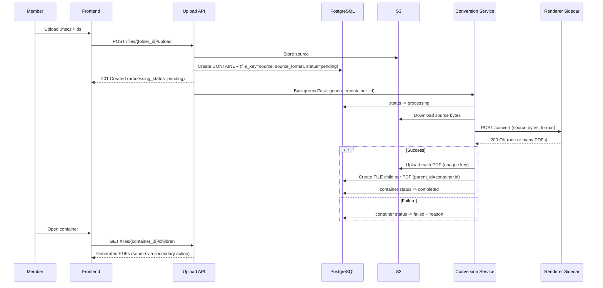
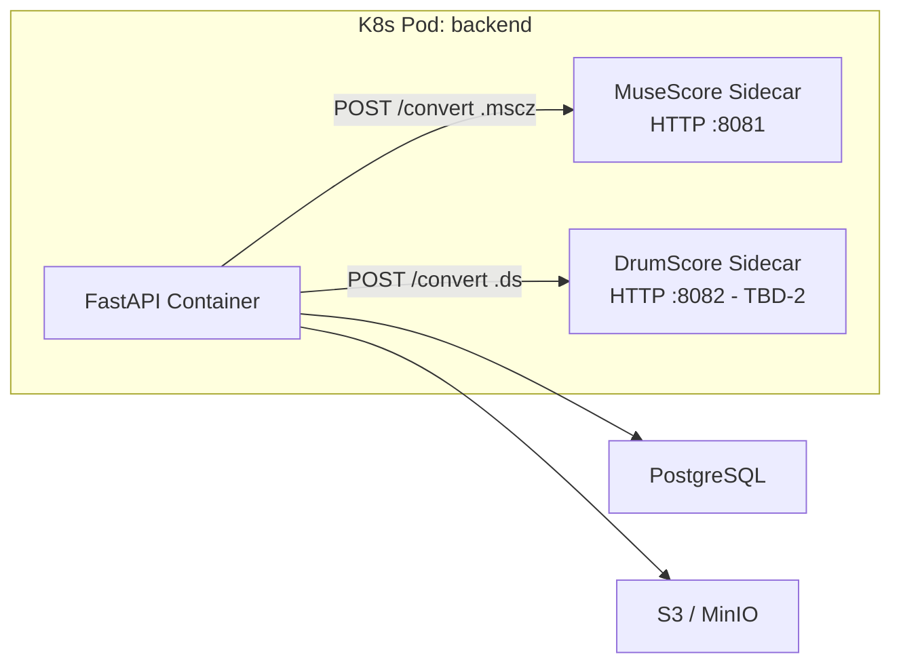
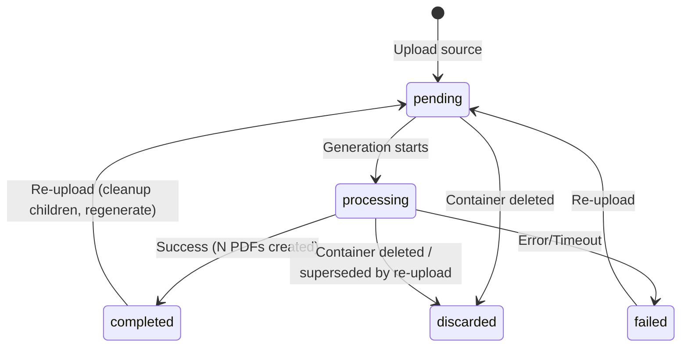

# Design Document: Score PDF Export

## Overview

This feature adds automatic PDF generation for music notation files (`.mscz` MuseScore, `.ds` DrumScore Editor) uploaded through the Bagad Men Ru file explorer. On upload, the source becomes a **Container** node that carries the source file itself and owns its generated PDFs as children. Generation runs asynchronously via FastAPI `BackgroundTasks`, invoking a renderer sidecar per source format. The frontend presents the Container as a single read-only group: the generated PDFs are the primary content and the source is a discreet secondary download.

The data model reuses the existing `FileOrFolderDB` tree. The only structural addition is a third `Node_Type` value, `CONTAINER`, plus three nullable tracking columns (`source_format`, `processing_status`, `processing_failure_reason`). No parallel hierarchy and no per-child flag are introduced: a record is "container content" iff its parent's type is `CONTAINER`.

### Key Design Decisions

1. **Third node type `CONTAINER`, not a parallel hierarchy.** Earlier options (a `source_file_id` FK linking derivatives to their source) were rejected because they create a second hierarchy over the same tree and leave the generated PDFs flat in the folder, forcing the frontend to re-group and re-filter them. The requirements (PDFs first, source discreet, closed read-only group, bounded cleanup) are all *confinement* needs — a box, not a thread. `CONTAINER` is that box, expressed within the existing `parent_id`/`children` relationship.

2. **The Container carries the source.** The Container's `file_key` points at the uploaded `.mscz`/`.ds`. This makes re-upload a cleanup+regenerate against a stable anchor (the Container id/URL never changes) and makes the source a secondary download on the Container while the PDFs are its children. This is a deliberate, documented exception to "only FILE has a file_key": a Container is a source enriched with its renders.

3. **One source → N PDFs.** A `.mscz` yields the full score plus one PDF per part; a `.ds` yields a single PDF. The Container owning a *set* of PDF children models this directly. **[TBD-1, TBD-2]** The exact renderer invocations and the resulting file set are open (see Open Questions).

4. **BackgroundTasks over a worker queue.** Generation is CPU-bound but infrequent (a few uploads per week). FastAPI `BackgroundTasks` avoids Redis/Celery operational overhead at this scale; the conversion module is isolated enough to move to a dedicated worker later if needed.

5. **Renderer as HTTP sidecar(s).** Each renderer runs in its own container exposing a simple HTTP `POST /convert`. The backend POSTs the source and receives the PDF(s). This decouples the renderer's arch/libc from the backend. **[TBD-2]** Whether `.ds` has a containerizable headless renderer (one sidecar vs two, or `.ds` dropped to a later phase) is open.

## Open Questions (TBD)

| ID | Question | Blocks | Status |
|----|----------|--------|--------|
| TBD-1 | Exact MuseScore 4 CLI/command to export full score + one PDF per part, resulting file set, part-name source | Req 1.4, 2.3, 2.4 | **RESOLVED** (spike) — see below |
| TBD-2 | DrumScore Editor headless/CLI → PDF; containerizable? | Req 1.3, 1.4; sidecar architecture | **RESOLVED** — `DrumScoreEditor createPDF <in> <out>` (v3.1.5+); see below |
| TBD-3 | Timeout budget for multi-part MuseScore export | Req 1.5, 4.5 | OPEN — provisional 120s; re-measure on a real multi-part score |
| TBD-4 | Part-name collision disambiguation | Req 2.4 | OPEN — depends on observed part filename format |

### TBD-1 resolution (MuseScore CLI, from the official MuseScore Studio Handbook — Command line usage)

MuseScore 4 runs headless in "converter mode" and exports PDFs two ways:

- **Full score only:** `mscore -o '<base>.pdf' '<base>.mscz'` — single conductor PDF.
- **Full score + every part in ONE PDF (parts appended):** add `-P` / `--export-score-parts`. Quote from the handbook: *"When converting to PDF with the -o option, append each part's pages to the created PDF file. If the score has no parts, all default parts will temporarily be generated automatically."* This yields a **single** PDF, not one file per part — so `-P` alone does NOT satisfy "one PDF per part".
- **One PDF file PER part (what we want):** use the **batch job JSON** (`-j job.json`). The job's `out` target may be a JSONArray where an element is itself a **two-string tuple** `["<prefix>", "<suffix>.pdf"]`; MuseScore then saves **each extant part individually**, composing the filename as `<prefix>` + part title + `<suffix>`. Handbook example: a tuple produces files like `"MyScore3 (Violin part).pdf"` alongside the conductor's PDF. If the score defines no excerpts/parts, the per-part request is **silently ignored** (no error) and only the conductor PDF is produced.

**Consequence for the design:**
- The MuseScore sidecar invokes a `-j job.json` job whose `out` lists both the conductor PDF (plain `"<base>.pdf"`) and a part tuple (e.g. `["<base> - ", " part.pdf"]`), producing: `<base>.pdf` + one `<base> - <PartTitle> part.pdf` per part. This directly realizes Req 1.4 / 2.3 (1 + K PDFs).
- Part names come from MuseScore part titles (the tuple only supplies the fixed prefix/suffix) → **TBD-4** reduces to "can two parts share a title?" (possible with duplicated instruments); disambiguation still needed.
- A score with no parts degrades gracefully to a single conductor PDF — matches the `.ds`-like single-PDF shape, so the pipeline is uniform.
- Headless needs `xvfb-run` (Qt GUI app) and `-F`/factory settings in CI to avoid user-config side effects.

**TBD-2 (DrumScore) resolution.** DrumScore Editor restored its command-line PDF export in v3.1.5. Syntax (confirmed by Mael, [DrumScore releases](https://support.drumscore.scot/releases?version=3.1.5&lang=en)):

```
DrumScoreEditor createPDF <in_ds_or_dir> <out_pdf_or_dir>
```

- File→file form: one `.ds` → **one** PDF (no parts), matching Req 1.4's single-PDF rule for `ds`.
- The in/out-as-directory form (batch a folder) is not needed here; the sidecar passes a single file in and a single file out.
- Open sub-questions for the DrumScore phase: (a) platform/build — is there a Linux binary for a container, or must it run under Wine / on a Windows base image? (b) does it need a display server (`xvfb`) like MuseScore, or does `createPDF` run truly headless? These are build/packaging details for Phase 4, not design blockers — the invocation contract is now fixed.

## Architecture



### Deployment Architecture



**[TBD-2]** The DrumScore sidecar (C) is conditional on a containerizable `.ds` renderer existing. If none exists, `.ds` support is deferred and only the MuseScore sidecar ships in phase 1.

## Components and Interfaces

### 1. Node Type Extension (`bbe2/schemas/file.py`)

```python
class FileOrFolderType(Enum):
    DIRECTORY = "DIR"
    FILE = "FILE"
    CONTAINER = "CONTAINER"
```

Every existing `if type == DIR/FILE` site becomes potentially non-exhaustive and must explicitly decide the CONTAINER case. The impact sites (to be enumerated by a type-usage audit before coding) include at least: `delete_file` (S3 deletion), `list_children` (child counting / presentation), `upload_file` and `create_folder` (reject into a CONTAINER), `update_file` (reject child edits). Frontend icon/navigation branches on `type` must add the CONTAINER case.

### 2. Conversion Service (`bbe2/services/conversion.py`)

```python
class ConversionService:
    def __init__(self, s3: S3Helper, session_factory: sessionmaker,
                 renderers: dict[str, str]):  # {"mscz": url, "ds": url}
        self.s3 = s3
        self.session_factory = session_factory
        self.renderers = renderers
        self.timeout_seconds = 120  # TBD-3

    async def generate(self, container_id: int) -> None:
        """Full pipeline: download source, render, upload PDFs,
        create children, update status. Handles all errors internally."""
        ...

    async def _render(self, source_bytes: bytes, source_format: str,
                      base_name: str) -> list[tuple[str, bytes]]:
        """Return [(pdf_display_name, pdf_bytes), ...]. One entry for ds,
        many for mscz (full score + parts). TBD-1/TBD-2 for exact mapping."""
        ...
```

Contract:
- `generate(container_id)`: sets status processing → downloads source from S3 → `_render` → uploads each PDF under an opaque key → creates one FILE child per PDF → status completed. On any failure, status failed + reason; no partial children. Before writing results, re-checks the Container status is not "discarded"/superseded (re-upload race, Req 5.5, 6.4).
- `_render`: routes on `source_format` to the matching sidecar; returns the list of (name, bytes). **[TBD-1/2/4]** owns the part-naming and multiplicity logic.

### 3. Upload Endpoint (`bbe2/api/v1/endpoints/files.py`)

Extended to:
1. Reject upload when `folder_id` is a CONTAINER → 403 (Req 7.1).
2. Detect a supported source extension; if so, create/replace a CONTAINER (not a FILE) and enqueue `generate`.
3. On re-upload (same base name + parent, existing CONTAINER): replace source S3 object, delete existing PDF children (DB + S3), reset status to pending, enqueue a fresh `generate` (Req 5). Container id preserved.
4. Non-source uploads keep today's behavior (regular FILE).

### 4. Create-Folder, Update, Delete Endpoints

- `create_folder`: reject when parent is a CONTAINER → 403 (Req 7.2).
- `update_file` / `delete_file`: reject when the target's parent is a CONTAINER → 403 (Req 6.3, 7.3). Deletion of the CONTAINER itself is allowed and must delete the source S3 object **and** every child PDF S3 object (explicit loop; the FK cascade only covers DB rows — this is the orphaned-blob bug called out in the existing filesystem review). On S3 failure, log the orphaned key and proceed (Req 6.2).

### 5. File Schema (`bbe2/schemas/file.py`)

```python
class FileOrFolder(_FileOrFolderBase):
    ...
    type: FileOrFolderType
    source_format: Optional[str] = None
    processing_status: Optional[str] = None
    processing_failure_reason: Optional[str] = None
    child_count: Optional[int] = None
    # fileUrl / downloadUrl already present; for a CONTAINER they resolve to
    # the source (file_key) and back the discreet "source" action (Req 3.4).
```

The frontend derives presentation from `type == CONTAINER` + `processing_status`; no `is_mscz_folder` computed flag and no listing transformation are needed, because the Container is a real node, not a disguised file.

### 6. Children Endpoint

`list_children` of a CONTAINER returns its Generated_PDF children (the primary content). The source is not a child — it is the Container's own `file_key`, surfaced through the Container's `downloadUrl` (secondary action). Generated PDF children are therefore never duplicated into the parent folder listing: they only exist under the Container.

### 7. Renderer HTTP Sidecar(s)

```
POST /convert
Content-Type: multipart/form-data
Body: file=<source binary>; format=<mscz|ds>

Response 200: application/json or multipart
  { "pdfs": [ { "name": "<display name>", "content_b64": "..." }, ... ] }
Error: 422 (invalid source) | 500 (renderer crash)
```

A multi-PDF response shape is required because `.mscz` yields many PDFs. **[TBD-1]** The MuseScore sidecar internally runs the parts-export command (exact command TBD) and returns the full score + each part. **[TBD-2]** The DrumScore sidecar returns a single PDF, or does not ship in phase 1.

## Data Models

### FileOrFolderDB Extension

```python
class FileOrFolderDB(Base):
    __tablename__ = "files"
    # existing: id, name, file_key (nullable), type, parent_id (FK self, cascade),
    #           children (relationship), uploaded_at, UniqueConstraint(name, parent_id)

    source_format: Mapped[Optional[str]] = mapped_column(String(8), nullable=True, default=None)
    processing_status: Mapped[Optional[str]] = mapped_column(String(16), nullable=True, default=None)
    processing_failure_reason: Mapped[Optional[str]] = mapped_column(String(512), nullable=True, default=None)
```

| Column | Type | Nullable | Default | Meaning |
|--------|------|----------|---------|---------|
| `source_format` | String(8) | yes | NULL | `mscz` / `ds` on a CONTAINER; NULL otherwise |
| `processing_status` | String(16) | yes | NULL | pending / processing / completed / failed on a CONTAINER; NULL otherwise |
| `processing_failure_reason` | String(512) | yes | NULL | failure cause when failed |

Node semantics:
- `CONTAINER`: `file_key` = source S3 key; `source_format`/`processing_status` set; `children` = Generated_PDF FILEs.
- `FILE` child of a CONTAINER: a Generated_PDF; its own `file_key`; read-only (parent is CONTAINER).
- `DIR` / plain `FILE`: unchanged.

### Alembic Migration

```python
def upgrade():
    op.add_column("files", sa.Column("source_format", sa.String(8), nullable=True))
    op.add_column("files", sa.Column("processing_status", sa.String(16), nullable=True))
    op.add_column("files", sa.Column("processing_failure_reason", sa.String(512), nullable=True))

def downgrade():
    op.drop_column("files", "processing_failure_reason")
    op.drop_column("files", "processing_status")
    op.drop_column("files", "source_format")
```

No enum DB constraint change is required if `type` is stored as a string/enum that already tolerates a new value; the type-usage audit confirms the storage representation before migration.

### State Machine (per Container)



## Correctness Properties

### Property 1: Supported Source Creates a Pending Container
*For any* upload whose extension is a supported Source_Format (case-insensitive), the created record SHALL have `type = CONTAINER`, `source_format` set, and `processing_status = "pending"`; for any unsupported extension the record SHALL be a `FILE` with null container fields.
**Validates: Req 1.1, 1.2, 4.1, 9.1–9.4**

### Property 2: Container Content Is Defined by Parent Type
*For any* record, it is container content (read-only, deletion/modification forbidden individually) if and only if its parent record's `type` is `CONTAINER`. No other record is treated as container content.
**Validates: Req 6.3, 7.3, 9.8**

### Property 3: Read-Only Container Rejects Writes Into It
*For any* CONTAINER node, upload-into, create-sub-folder, and PUT/DELETE-child requests SHALL be rejected with 403; the same requests against a DIR SHALL NOT be rejected on this basis.
**Validates: Req 7.1, 7.2, 7.3**

### Property 4: Delete Cascade Cleans Up All Objects
*For any* CONTAINER with a source and N Generated_PDF children, deleting it SHALL remove the source S3 object, all N PDF S3 objects, and all N+1 DB records (children via FK cascade).
**Validates: Req 6.1**

### Property 5: Re-upload Preserves Identity and Replaces Content
*For any* re-upload matching an existing CONTAINER (same base name + parent), the CONTAINER's DB id SHALL be unchanged, its prior Generated_PDF children SHALL be removed (DB + S3), and after the new generation only the fresh children SHALL exist.
**Validates: Req 5.1–5.5**

### Property 6: Extra Formatting Parameters Are Ignored
*For any* upload request carrying extra formatting parameters, generation SHALL proceed with default renderer settings, identical to an upload without them.
**Validates: Req 8.3**

### Property 7 [TBD-1]: MSCZ Produces Full Score Plus One PDF Per Part
*For any* valid `.mscz` with K instrument parts, generation SHALL produce 1 + K Generated_PDFs (full score + one per part). Provisional pending TBD-1 (exact part set and names).
**Validates: Req 1.4, 2.3**

## Error Handling

| Failure | Detection | Recovery |
|---|---|---|
| Renderer non-2xx | `httpx.HTTPStatusError` | status=failed, store body as reason |
| Timeout (TBD-3) | `httpx.TimeoutException` | status=failed, "timed out" |
| Renderer unreachable | `httpx.ConnectError` | status=failed, "renderer unavailable" |
| Source download fail | `botocore ClientError` | status=failed, "source unavailable" |
| PDF upload fail | `botocore ClientError` | status=failed, "failed to store PDF"; roll back partial children |
| Corrupt source | sidecar 422 | status=failed, sidecar message |
| Container deleted/superseded mid-run | status check before write | abort silently (Req 5.5, 6.4) |
| Delete: child S3 delete fails | log orphan, proceed | Req 6.2 |

### Race Conditions
- **Re-upload during generation**: upload resets status to pending and (option) bumps a generation token; the in-flight run checks the token/status before writing and discards stale output.
- **Delete during generation**: upload sets status to discarded; the in-flight run checks before writing.

## Testing Strategy

### Spike First (resolves TBD)
Before implementing generation, a spike SHALL resolve TBD-1 (MuseScore parts export command + file set + naming) and TBD-2 (DrumScore CLI feasibility). The spike output updates Requirements 1.4/2.3 and this design's Property 7, and decides whether `.ds` ships in phase 1.

### Unit / Property Tests (pytest + Hypothesis, 100 iters, tag `# Feature: score-pdf-export, Property N: ...`)
- Property 1 → status/type assignment for supported vs unsupported extensions.
- Property 2 → container-content detection via parent type over random trees.
- Property 3 → 403 gates on upload/create-folder/update/delete against CONTAINER vs DIR.
- Property 4 → delete cascade removes all S3 objects + rows (mock S3).
- Property 5 → re-upload identity preservation + child replacement.
- Property 6 → extra params ignored.
- Property 7 **[TBD-1]** → mscz PDF multiplicity (after spike).

### Integration (CI, real sidecar)
Full pipeline mscz → full score + parts; `.ds` → single PDF (if in phase 1); re-upload replace; delete cascade with S3 verification.

### E2E (Playwright)
Upload source → wait → container appears with PDFs primary and source as secondary action; re-upload replaces PDFs; delete removes everything; failed generation shows the failure indicator.

## Phasing

1. **Spike** — resolve TBD-1/TBD-2 (and TBD-3/TBD-4 as consequences).
2. **Model + endpoints** — `CONTAINER` type, columns, migration, read-only gates, delete cascade (incl. S3), type-usage audit fixes. No renderer yet (status stays pending/failed).
3. **MuseScore generation** — sidecar + ConversionService for `.mscz` (full score + parts).
4. **DrumScore generation** — `.ds` sidecar, conditional on TBD-2.
5. **Frontend** — CONTAINER presentation, PDFs-first, discreet source, status/failure indicators.
